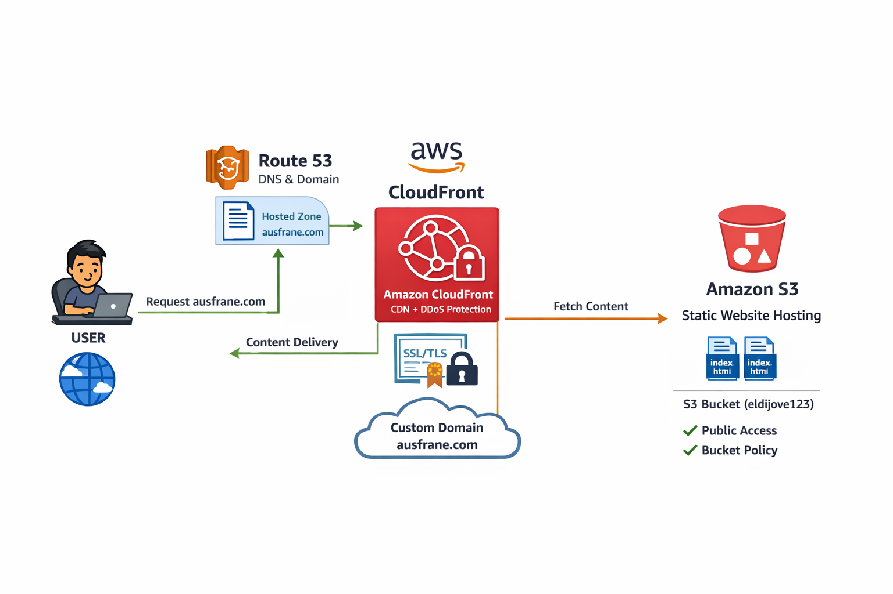
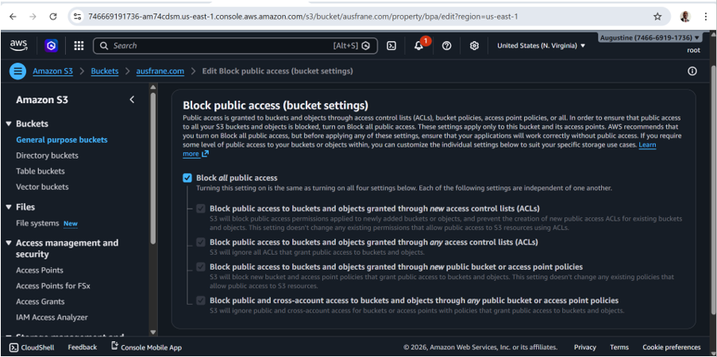
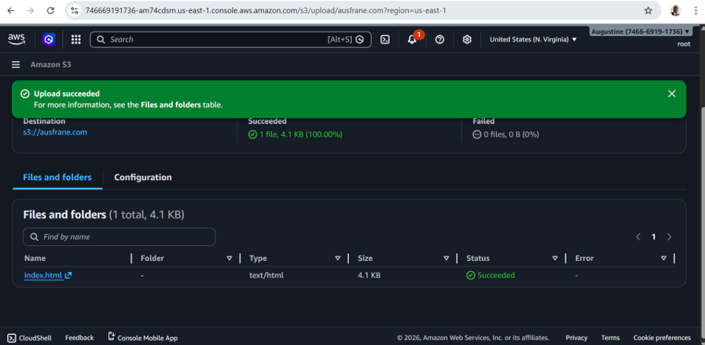
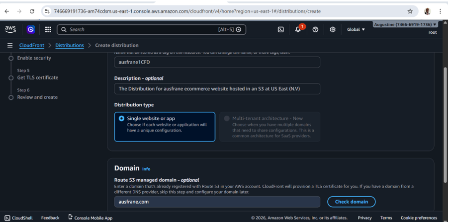
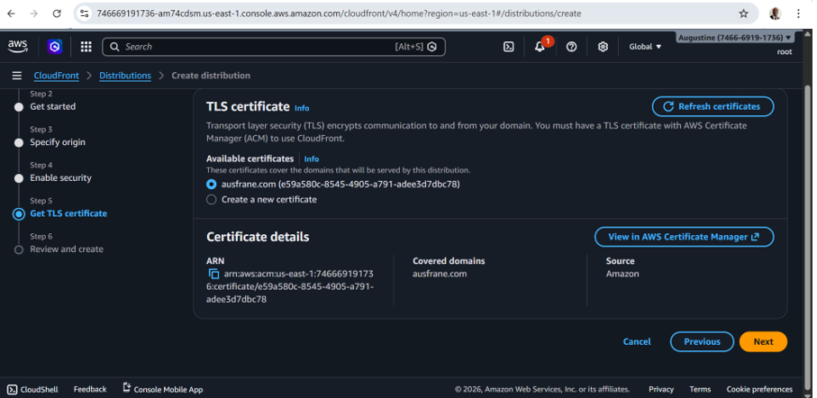
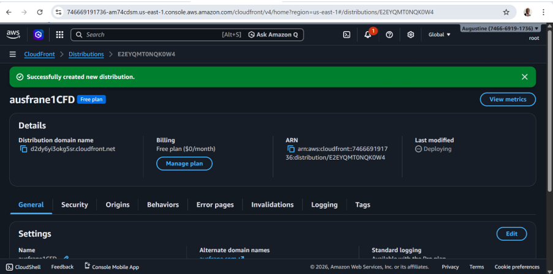
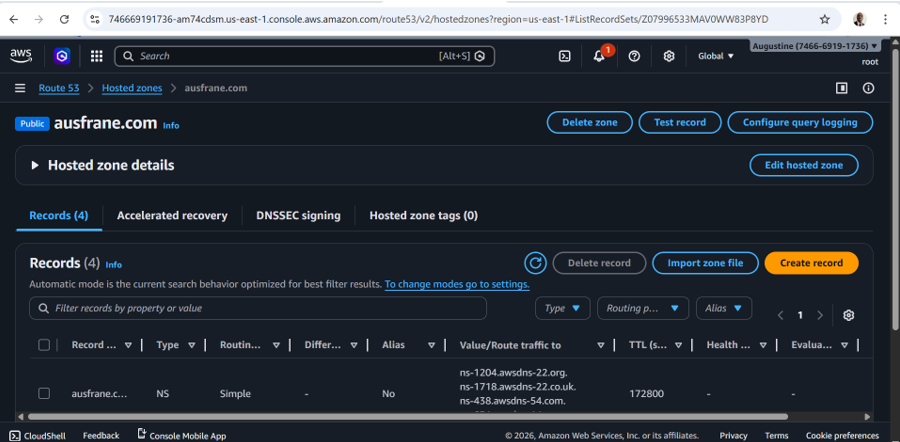
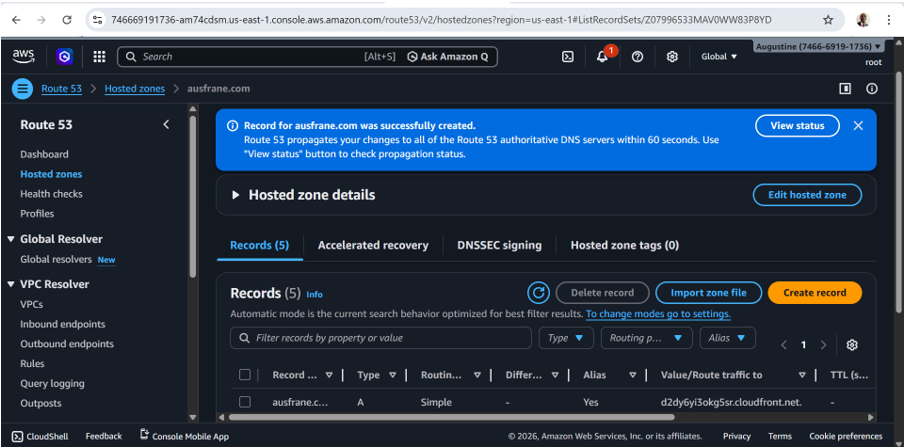
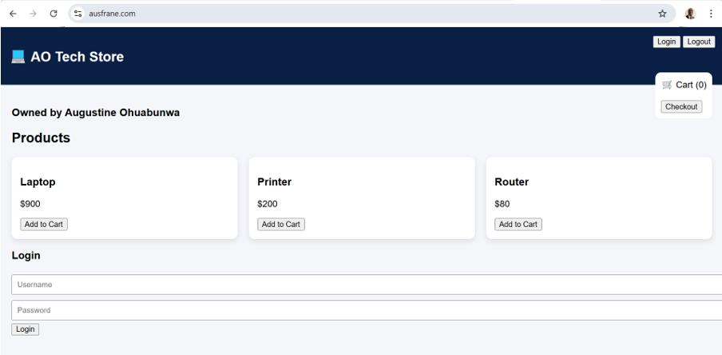

# 🌐 Enterprise Static Website Hosting on AWS

**Amazon S3 + CloudFront + Route 53 + HTTPS + Edge Security**


---

## 📖 Overview

This project demonstrates how to design and deploy a **secure, scalable, and production-grade static website hosting architecture** on AWS.

It leverages:

- **Amazon S3** for private object storage  
- **Amazon CloudFront** for global CDN and edge delivery  
- **Amazon Route 53** for DNS routing  
- **AWS Certificate Manager (ACM)** for HTTPS encryption  

---

## ❗ Problem Statement

Organizations hosting web applications globally often face:

- ❌ High latency for distributed users  
- ❌ Security risks from public S3 buckets  
- ❌ Lack of protection against DDoS attacks  
- ❌ Complex infrastructure scaling challenges  
- ❌ Poor content delivery performance  

---

## 💡 Solution

This project implements a **secure, serverless, edge-optimized architecture** using AWS managed services.

### Key Capabilities

- ✅ Private S3 bucket (no public access)  
- ✅ CloudFront CDN for global content delivery  
- ✅ HTTPS enforced using ACM certificates  
- ✅ Secure access using CloudFront Origin Access Control (OAC)  
- ✅ DNS routing via Route 53  
- ✅ Built-in DDoS protection via AWS Shield  

---

## 🏗️ Architecture Diagram

<p align="center">
  
</p>

---

## 🔄 Architecture Flow

1. User accesses domain (`ausfrane.com`)  
2. Route 53 resolves DNS request  
3. Request routed to nearest CloudFront edge location  
4. CloudFront fetches content from private S3 bucket  
5. Content cached and delivered globally  

---

## ⚙️ Tech Stack

| Service                 | Purpose                  |
| ----------------------- | ------------------------ |
| Amazon S3               | Static file hosting      |
| Amazon CloudFront       | CDN + caching + security |
| Amazon Route 53         | Domain + DNS routing     |
| AWS Certificate Manager | SSL/TLS certificates     |

---
## 📂 Project Structure

```
project-root/
├── index.html
├── screenshots/
└── README.md
```
---

## ⚙️ Implementation Steps

### 1️⃣ Create S3 Bucket

- Create bucket: `ausfrane.com`  
- Enable versioning and bucket key  
- Enable **Block Public Access**

---

### 2️⃣ Upload Website Files

- Upload `index.html`  
- Confirm file exists  

---

### 3️⃣ Disable Static Website Hosting

- Navigate to **Properties**  
- Disable static hosting  

---

### 4️⃣ Configure Bucket Policy

```json
{
  "Version": "2012-10-17",
  "Statement": [
    {
      "Sid": "AllowCloudFrontAccess",
      "Effect": "Allow",
      "Principal": {
        "Service": "cloudfront.amazonaws.com"
      },
      "Action": "s3:GetObject",
      "Resource": "arn:aws:s3:::ausfrane.com/*",
      "Condition": {
        "StringEquals": {
          "AWS:SourceArn": "arn:aws:cloudfront::746669191736:distribution/E2EYQMT0NQK0W4"
        }
      }
    }
  ]
}
```

---
### 5️⃣ Create CloudFront Distribution
- Origin: S3 bucket
- Viewer protocol: Redirect HTTP → HTTPS
- Attach ACM certificate
- Enable caching

---
### 6️⃣ Configure CloudFront
Set default root object: index.html

---
### 6️⃣ Create cache invalidation:

/*

---
### 7️⃣ Configure Route 53

- Create hosted zone: ausfrane.com

- Create record:

- Type: A (Alias)

- Target: CloudFront distribution


### 8️⃣ Access Website
https://ausfrane.com

## 🔐 Security Architecture
- Layer	Protection

- CloudFront	AWS Shield (DDoS protection)

- HTTPS	TLS encryption

- S3	Private bucket

- IAM	Least privilege

---

## 📸 Screenshots
S3 Bucket
<p align="center">  </p>
Upload
<p align="center">  </p>
CloudFront
<p align="center">  </p>
<p align="center">  </p>
<p align="center">  </p>
Route 53
<p align="center">  </p>
<p align="center">  </p>
Output
<p align="center">  </p>


## 📊 Business Impact

⚡ **60–80% latency reduction**  
🌍 Global edge delivery  
🔄 High availability architecture  
🔐 HTTPS + DDoS protection  
📉 ~80% reduction in operational overhead  

---

## 💼 Business Value

🚀 Faster deployments  
💰 Cost efficiency  
📈 Scalable architecture  
🔐 Improved security posture  
👨‍💻 Increased productivity  

---

## 🎯 Key Features

### 🌍 Global CDN Delivery
- Edge caching via CloudFront  
- Low latency worldwide  

### 🔐 Security
- Private S3 bucket  
- HTTPS enforcement  
- AWS Shield protection  

### ⚡ High Availability
- Fully serverless  
- No single point of failure  

### 📦 Cost Optimization
- Pay-as-you-go  
- Reduced origin requests  

---

## 🌍 Real-World Relevance

 🌐 Enterprise websites  
 🛒 E-commerce platforms  
 🚀 SaaS frontends  
 📱 Web applications  
 🏢 Internal portals

---

## 🧠 Key Learnings

- CDN reduces latency significantly

- Private S3 improves security

- CloudFront enhances performance and protection

- Route 53 enables reliable DNS routing

- Edge caching improves efficiency

---


## Terraform Implimentation

### 📁 Project Structure (Enterprise-Grade)

```

terraform/
│
├── backend/
│   └── backend.tf
│
├── environments/
│   └── prod/
│       ├── main.tf
│       ├── variables.tf
│       └── terraform.tfvars
│
├── modules/
│   ├── s3/
│   │   ├── main.tf
│   │   ├── variables.tf
│   │   └── outputs.tf
│   │
│   └── cloudfront/
│       ├── main.tf
│       ├── variables.tf
│       └── outputs.tf
│
├── provider.tf
└── versions.tf

```
---

⚙️ versions.tf

terraform {
  required_version = ">= 1.5.0"

  required_providers {
    aws = {
      source  = "hashicorp/aws"
      version = "~> 5.0"
    }
  }
}

```

---


### 🌍 provider.tf

```provider "aws" {
  region = "us-east-1"
}
🗄️ backend/backend.tf (Remote State)
terraform {
  backend "s3" {
    bucket         = "ausfrane-terraform-state"
    key            = "static-site/prod/terraform.tfstate"
    region         = "us-east-1"
    dynamodb_table = "terraform-locks"
    encrypt        = true
  }
}
```

---

### 👉 You must create:

- S3 bucket: ausfrane-terraform-state

- DynamoDB table: terraform-locks (Primary key: LockID)

### 🧩 MODULE: S3 (modules/s3)

- variables.tf

variable "bucket_name" {}

- main.tf

```resource "aws_s3_bucket" "this" {
  bucket = var.bucket_name

  tags = {
    Name        = var.bucket_name
    Environment = "Production"
  }
}

resource "aws_s3_bucket_versioning" "versioning" {
  bucket = aws_s3_bucket.this.id

  versioning_configuration {
    status = "Enabled"
  }
}

resource "aws_s3_bucket_server_side_encryption_configuration" "enc" {
  bucket = aws_s3_bucket.this.id

  rule {
    apply_server_side_encryption_by_default {
      sse_algorithm = "AES256"
    }
  }
}

resource "aws_s3_bucket_public_access_block" "block" {
  bucket = aws_s3_bucket.this.id

  block_public_acls       = true
  block_public_policy     = true
  ignore_public_acls      = true
  restrict_public_buckets = true
}
outputs.tf
output "bucket_id" {
  value = aws_s3_bucket.this.id
}

output "bucket_arn" {
  value = aws_s3_bucket.this.arn
}

output "bucket_domain_name" {
  value = aws_s3_bucket.this.bucket_regional_domain_name
}

```

---

### 🌐 MODULE: CloudFront (modules/cloudfront)

variables.tf

variable "bucket_domain_name" {}

variable "bucket_arn" {}

- main.tf

```resource "aws_cloudfront_origin_access_control" "oac" {
  name                              = "ausfrane-oac"
  origin_access_control_origin_type = "s3"
  signing_behavior                  = "always"
  signing_protocol                  = "sigv4"
}

resource "aws_cloudfront_distribution" "this" {
  enabled             = true
  default_root_object = "index.html"

  origin {
    domain_name              = var.bucket_domain_name
    origin_id                = "S3-origin"
    origin_access_control_id = aws_cloudfront_origin_access_control.oac.id
  }

  default_cache_behavior {
    target_origin_id       = "S3-origin"
    viewer_protocol_policy = "redirect-to-https"

    allowed_methods = ["GET", "HEAD"]
    cached_methods  = ["GET", "HEAD"]

    forwarded_values {
      query_string = false
      cookies {
        forward = "none"
      }
    }
  }

  viewer_certificate {
    cloudfront_default_certificate = true
  }

  restrictions {
    geo_restriction {
      restriction_type = "none"
    }
  }
}

resource "aws_s3_bucket_policy" "policy" {
  bucket = replace(var.bucket_arn, "arn:aws:s3:::", "")

  policy = jsonencode({
    Version = "2012-10-17"
    Statement = [
      {
        Sid    = "AllowCloudFrontAccess"
        Effect = "Allow"

        Principal = {
          Service = "cloudfront.amazonaws.com"
        }

        Action = "s3:GetObject"
        Resource = "${var.bucket_arn}/*"

        Condition = {
          StringEquals = {
            "AWS:SourceArn" = aws_cloudfront_distribution.this.arn
          }
        }
      }
    ]
  })
}

```

---

- outputs.tf

```output "distribution_domain_name" {
  value = aws_cloudfront_distribution.this.domain_name
}

output "distribution_arn" {
  value = aws_cloudfront_distribution.this.arn
}

```
---

### 🌍 ENVIRONMENT: prod

environments/prod/variables.tf

```variable "bucket_name" {
  default = "ausfrane.com"
}
environments/prod/terraform.tfvars
bucket_name = "ausfrane.com"
environments/prod/main.tf
module "s3" {
  source      = "../../modules/s3"
  bucket_name = var.bucket_name
}

module "cloudfront" {
  source              = "../../modules/cloudfront"
  bucket_domain_name  = module.s3.bucket_domain_name
  bucket_arn          = module.s3.bucket_arn
}

```

---

### 🚀 Deployment Workflow

- cd terraform

- terraform init

- terraform plan

- terraform apply

---

### 🔐 Enterprise Best Practices Implemented

✅ State Management

- Remote backend (S3)

- State locking (DynamoDB)

✅ Modularity

- Reusable S3 module

- Reusable CloudFront module

✅ Security

- Private S3 bucket

- OAC-based access

- No public exposure

✅ Scalability

- Environment-based deployment

- Easily extendable to dev/stage/prod

---

### 📈 Future Improvements

🔒 Implement full OAC

🛡️ Add AWS WAF

⚙️ Automate deployment using Terraform

🔄 CI/CD with GitHub Actions

📊 Monitoring with CloudWatch

---


### 👨‍💻 Author


Static Website Hosting Project by: [Augustine Ebere Ohuabunwa] Solution Architect | DBA | AWS Certified | 
Cost Optimization, Automation & Security | Enterprise Systems

---

### 📜 License

This project is for educational and real-world implementation purposes.

---

### ⭐ Final Note

🌍 Global scalability

🔐 Secure architecture

⚡ High performance

📈 Enterprise-ready design
